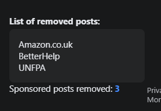
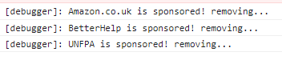

# Tampermonkey / Facebook 'Sponsored' posts remover

Since uBlock can't quite handle facebook spam, this little script when run as tampermonkey/greasemonkey script should hide these annoying ads on facebook wall.
To verify it's working, you should see this in the top left corner of the facebook wall:

This counter will update as sponsored ads are being removed on page scroll.

Bear in mind that the removed posts list is hidden by default not to obstruct any view.
To see it, you need to hover the `Sponsored posts removed: x` element.

You should also be able to see logs in the console

